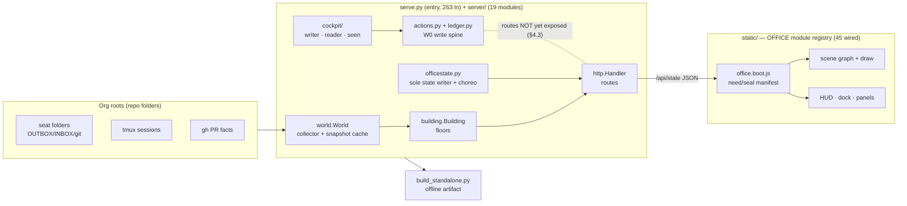
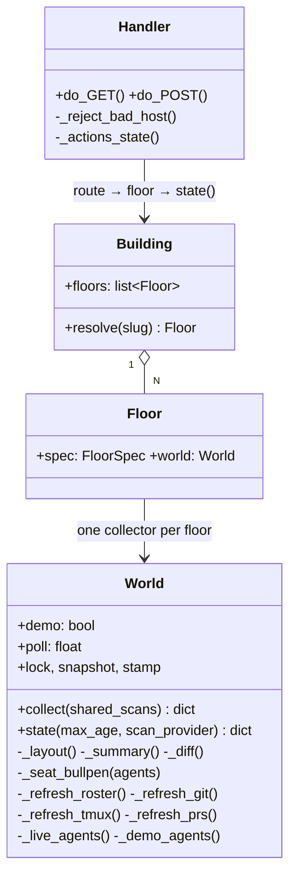
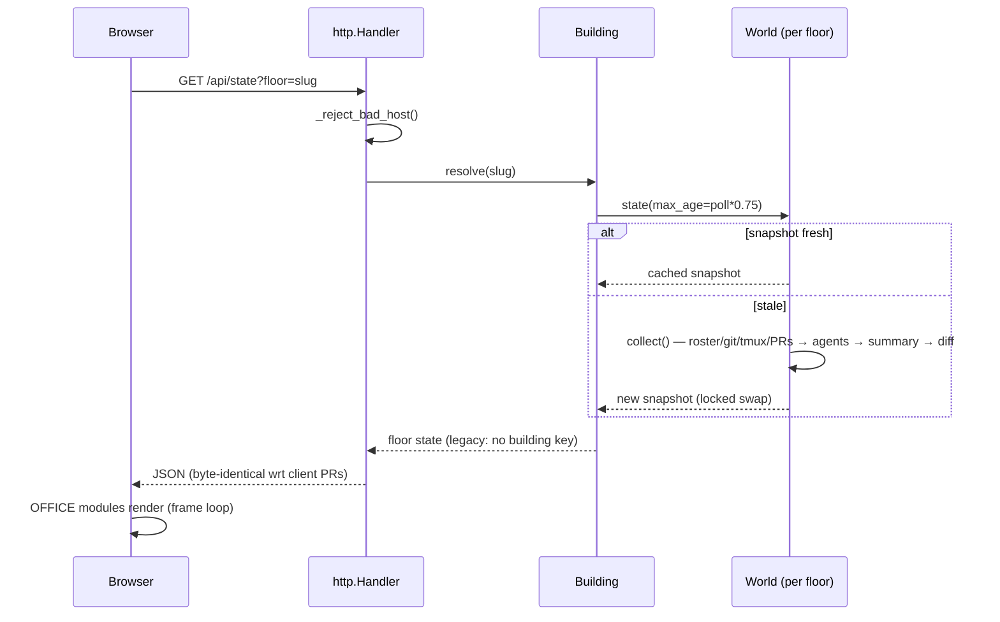
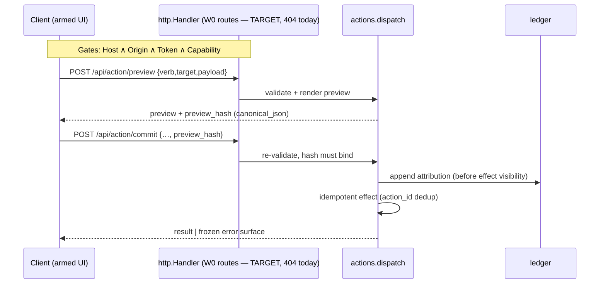
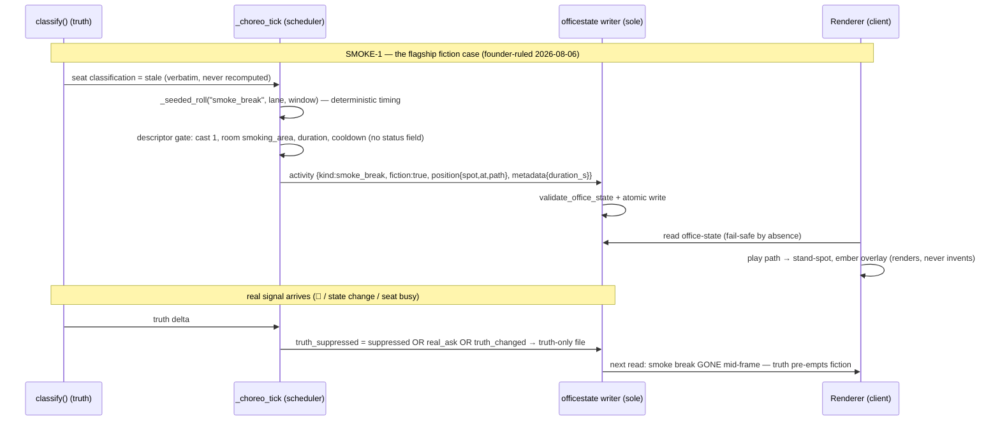

# TECH-ARCHITECTURE — the technical architecture of record
**Author: Robert California, CTO · 2026-08-06 · Verified at tip `de6f92c` (#276, selftest 158/0).**
**Companion: `tech-architecture.html` (same content, self-contained/offline).**

> **Correction block — 2026-09-07.** The counts and route facts below describe
> the tree at #276 and are stale. As of this restamp: `server/` has **59**
> modules (not 19); `static/index.html` loads **205** script tags (not 45) and
> lazily imports a WebGL/three.js renderer from `office.webgl.mount.js`; the
> W0 routes are **live** behind the four-gate spine (§4.3 said 404); `serve.py`
> is ~540 lines. §2.2's module table, §3.2's wired graph, and §3.3's unwired
> list are historical. The Canvas-2D renderer described in §3 is legacy and
> slated for removal. The doctrine in §1 and the contracts in §4 still hold.
> A full rewrite is owed (`STATUS.md`, open items).

> **Document of record.** Where this document contradicts `ARCHITECTURE.md`,
> `MODULES.md`, or `SERVER-MODULES.md`, THIS document wins going forward
> (supersessions in §9). Every symbol and route named here was grep-verified
> against #276, not inherited from prior docs — soren's SOL-048 filing
> catalogs 30 stale cites in the older set; none are carried here.

---

## §1 — System overview

The Office is an **isometric live floor view of an agent org**: a stdlib-only
Python server that *collects* truth about real agent seats (folders, git,
tmux, PRs) and *projects* it to a zero-dependency canvas client. Doctrine
that shapes every component:

- **The office invents nothing.** Every rendered fact traces to a collector
  observation. Unknown input fails visibly (no `default:` cases).
- **The STATUS parse never diverges from the sweep** — one parser, one truth.
- **stdlib only.** No pip installs server-side; no CDN, framework, or build
  step client-side.
- **A finished seat outranks a live one.** Truth (git, files) beats liveness.
- **Reads are open; writes go through one spine** (W0, §4.3) — no ad-hoc
  write paths, ever.
- **The bake must carry the product** — anything that can't survive
  `build_standalone.py` is not "done".

## §2 — Server architecture

### 2.1 Entry: `serve.py` (263 lines — CLI, wiring, nothing else)

Post SM7/SM8 the old monolith is gone; `serve.py` parses flags, resolves
roots, builds the `Building`, and starts `ThreadingHTTPServer` with
`http.Handler`. Flags at #276: `--port --host --demo --poll --once --json
--check --allow-actions --org --floor --floors --office-state`.
Environment: `$OFFICE_ALLREPOS` (root rung 1), `$OFFICE_FLOORS`,
`OFFICE_ROSTER_ONLY=1` (manifest-only floors — process-wide: a floor with no
manifest renders empty). `--floors N` requires `--demo`.

### 2.2 `server/` module map (19 modules, one responsibility each)

| Module | Owns |
|---|---|
| `world.py` | `World` — the collector. `collect()` orchestrates `_refresh_roster/_git/_tmux/_prs`, `_live_agents` vs `_demo_agents`, `_seat_bullpen` layout, `_summary`, `_diff` (feed events). `state(max_age)` = lock-guarded snapshot cache, one filesystem pass per client poll (`max_age = poll × 0.75`). |
| `http.py` | `Handler`. **GET:** `/api/state`, `/api/sweep`, `/data/sku-map.json`, `/data/*`, static files (path-prefix jailed to `roots.STATIC`, `assets/` cached 86400, else `no-store`). **POST:** exactly `/api/sweep`, `/api/attach`, `/api/settings/write-mode` — everything else 404. Host allowlist via `_reject_bad_host()` on every live route. |
| `building.py` | `FloorSpec`/`Floor`/`Building`, `slugify`, `parse_floor_specs`, `UnknownFloor`. Multi-floor spine (FL2): floors emit in `/api/state`; legacy mode (no floors declared) emits **no** `building` key — pinned byte-identity (proven 0-diff by SOL-085). |
| `officestate.py` | **Sole writer** of the office-state file: `validate_office_state` (strict schema: `suppressed` must be boolean, choreo bits carry `kind/cast_size/rooms/duration_s/cooldown_s`), `_write_office_state` (atomic), choreo runtime (`_choreo_tick`, `_seeded_roll` deterministic PRNG, `_truth_activity`). **Truth-suppression invariant (post-#271-fix):** `truth_suppressed = suppressed OR real_ask OR truth_changed` — any real signal kills fiction immediately. |
| `actions.py` | W0 verb registry. `Action` dataclass, `register()` (no overwrite), `dispatch()`, `canonical_json`, `preview_hash`. One registered verb at tip: `cockpit-message` (`capability="comms"`). Importing never performs effects. |
| `ledger.py` | W0 append-only action ledger (attribution). |
| `cockpit/` | `writer.py` (inbox write), `reader.py` (poll read), `seen.py` (mark-seen) — the cockpit engine, assembled, awaiting its HTTP route (§5.1). |
| `roots.py` | Root resolution, 4 rungs — rung 1 `--org`/`$OFFICE_ALLREPOS` is canonical (`--allrepos` accepted as a hidden alias); rungs 2–3 legacy-compat (never delete); rung 4 bare-clone fallback. |
| `roster.py` / `lanes.py` / `states.py` / `procs.py` / `gitfacts.py` | Roster manifest (+ mtime invalidation), lane folder scan, STATUS-block parse (single shared parser — the no-divergence doctrine lives here), process/tmux liveness, git facts. |
| `attach.py` | `_open_terminal_attach(lane)` — floor-aware since #270. |
| `assets.py` | Manifest/licence helpers, deterministic `render_credits` (#224). |
| `props.py` / `floorplan.py` | Server-side prop registry & floor layout truth. |
| `check.py` | `check_file()` — friendly read-only validation of a generic agent spool file (GEN-4 on-ramp, #248). |

### 2.3 `World` (the one real server class besides `Handler`/`Building`)

**Isolation model:** one `World` per floor; no shared mutable caches between
floors; attach/wake resolve the *requested building floor* (#269/#270) so
cross-floor actions are explicit, never ambient.

## §3 — Client architecture

### 3.1 The OFFICE module registry (`office.boot.js`)

Zero-framework module system: `OFFICE.module(name, deps, factory)` registers
into `OFFICE._reg`; `need(path, by)` throws **by name** on any unresolved
dependency ("a missing identifier kills the whole floor" — this is the
structural answer); `seal()` closes registration after the manifest count
check (`manifestModuleCount()` vs script tags). Load order = the script-tag
order in `static/index.html`; `office.main.js` runs the
`requestAnimationFrame(frame)` loop (office.main.js:70,192).

### 3.2 Wired module graph at #276 (45 scripts, in manifest order)

boot → resolve (settings chain URL>storage>default) → settings.panel →
theme → geom → gfx → states → actors → furniture → props.core/office/
naruto/beach → claims → state → done.visuals → camera → pan → select → hud →
avatar → plate + plate.vietnam/manhattan/debug → scenery → scene → needs →
feed → inspector → sweep → welcome → tooltips → elevator → ticker →
cockpit.chat → **main** → talk → ctxactions → contextmenu → keyboard →
follow → hovercard → store.panel → dock (#275/#276).

### 3.3 Unwired at tip — honest status (13 static/*.js not in the manifest)

| Class | Files | Status |
|---|---|---|
| **DEAD-AT-TIP, WIRE-1 pending** | `boards.js` (d3+d5 boards), `notify.js`, `notify.ui.js`, `notify.badge.js`, `notify.strings.js`, `welcome.glossary.js` | Complete features referenced by nothing in the page. GATE-REC §6 finding; WIRE-1 is the minted sole-`index.html`-owner fix packet. |
| Dual-consumed (QA/node, not page) | `sim.js`, `stats.js` | Consumed by qa harnesses/goldens (`qa/sim_route_harness.js`, flavour tests); page wiring is a separate, deliberate decision. |
| Unwired, consumers pending | `briefing.js` (D9), `bouts.js`, `clock.js`, `economy.js`, `choreo.rooms.js` | Landed modules whose page integration is owned by queued packets (boards/choreo/economy chains). Not fictional — just not yet reachable. |

**Doctrine note:** "isolated probes green ≠ integrated" (omar). Integration =
page-manifest presence + route reachability; that is now a standing audit
class, and this table is its baseline.

## §4 — Data contracts & pipelines

### 4.1 `/api/state` (the product's one read contract)

`Handler.do_GET` → `Building.resolve(floor)` → `World.state()` → JSON.
Byte-identity doctrine: client PRs must not change the payload (SOL-004/085
audit classes); legacy single-floor emits no `building` key (pin #154,
proven at #270). `_diff()` produces feed events server-side — the client
renders, never invents. **Known invariant break (omar SOL-013, open):** the
#267 write-mode toggle surfaces capability state via `/api/state` —
capability does not belong in the frozen read contract; fix rides with the
W0 spine work.

### 4.2 Office-state file + choreo

`officestate.py` is the **sole writer** (atomic write, strict validation).
The choreo engine (CE-4/5/6, #232 + suppression fix #271-class) runs
truth-first: deterministic `_seeded_roll` schedules fiction bits; validated
against the registry (`rooms` non-empty, no defaults); *any* truth delta —
suppression flag, real ask, or state-string change — sets
`truth_suppressed` and fiction yields. **Nothing fictional goes live without
per-type founder go-live rulings + adversarial re-verify (bassam-class).**
The flagship first case is **SMOKE-1** (stale seat walks to the smoking
apron; worked example of record in CHOREO.md §3.3b, end-to-end sequence in
§7): truth-triggered, tame, cast 1, full suppression invariant.

### 4.3 W0 write spine — specified vs at-tip

Specified (CONTRACTS §4, frozen): four conjunctive gates on every write —
**Host** (loopback bind + allowlist) · **Origin** (exact origin + header) ·
**Token** (per-run `X-Office-Token`, constant-time compare) · **Capability**
(per-verb, e.g. `--allow-comms`) — plus preview/commit with `preview_hash`
binding, idempotent effects, ledger attribution before effect visibility.

At #276 (verified by omar's SOL-013 route probes, re-confirmed): the four W0
routes (`/api/action/preview`, `/api/action/commit`, `/api/capabilities`,
`/api/ledger`) **return 404 — fail-closed**. `actions.py`/`ledger.py` exist
and are sound as modules; `cockpit-message` is registered but unreachable
over HTTP. Gaps to close before any W0 route ships: no token mechanism
anywhere in the tree; `--host` accepted without loopback refusal; runtime
re-arm via same-origin+static header alone; direct `dispatch()` skips the
capability check. **SOL-076 (placement commit) and COC-2 stay blocked on
exactly this list** (freya SOL-012 adds: stored attribute-XSS class + no CSP
= HARD BLOCK until fixed).

### 4.4 Bake pipeline (`build_standalone.py`)

`build(out, fragment, theme, mode)`: takes a live `/api/state`-shaped
snapshot, strips `VOLATILE` keys, inlines every manifest script
(`script_manifest()` — the same manifest §3.1 seals against) and plate
assets (`inline_plate_assets`, data-URIs), emits one offline HTML artifact
(1.76 MB at #276, bake pins green). The bake carries: the full client, the
snapshot, inlined assets, theme/mode. It does NOT carry: live polling,
actions (write surface), attach, cockpit round-trip — a baked floor is
read-only by construction. `tech-architecture.html` obeys the same rule
(no external fetch) so the bake can carry the architecture doc itself.

### 4.5 Asset pipeline

`static/assets/` + MANIFEST with provenance classes (#211 scaffold, #251
Manhattan provenance + regenerated CREDITS via deterministic renderer #224;
PNG intake helpers #210 reject non-PNG). Provenance classes at tip:
CC0-vetted (Kenney/Quaternius/OGA — licence archived + hash at fetch, zero
spend) and org-authored. **Pending class: generated-art** — no AI-generated
asset promotes to a production theme until the founder-ruled provenance
class lands (the Vietnam photoreal plate stays demo for exactly this
reason). Avatar charter exception (founder 2026-08-06): static rights-clean
sprite *components* allowed; all state/behavior stays procedural.

## §5 — In-flight architecture (what the waves are building, stack-ranked)

1. **Cockpit round-trip (COC-2/3 + client).** Engine assembled (writer,
   reader, seen, verb, chat shell wired). Missing: the POST route (COC-2) —
   gated on the four-gate spine + CSP fixes (§4.3); then `/api/cockpit/
   messages?since=` poll (COC-3) — the shell already fetches both targets
   and 404s honestly. This is the #1 MVP gap.
2. **Asset/placement:** theme capability `placementMode`, PlacementStore +
   occupancy (typed claims + compatibility matrix — NOT a boolean grid),
   placement commit via W0 (SOL-076, blocked on §4.3), inspector provenance
   integration, `BAKE-PLACE-1` (placements survive the bake).
3. **Settings with real assets:** two Manhattans (authored showpiece locked;
   Editable Manhattan as separate registered theme), Vietnam kit, HQ/beach
   production scenes behind `SET-PROD-CONTRACT`.
4. **Marketplace UI:** store panel landed (#276); inventory/owned panel →
   purchase flow with provenance-tied listings (MKT-UI-2/3), economy readers.
5. **Choreo:** staging gate (`proposed→ruled→live`), tame activity set
   first, social set behind go-live verifies.
6. **Avatar:** office-owned layered kit + one calibration character;
   variant preview + persistence.
7. **Dad-MVP** as the integration bar across all of the above; plus
   **WIRE-1** (§3.3) and the GEN Source seam (SOL-072/073: `OrgSource`/
   `DemoSource`/`DirSource` — once the collector reads through a Source,
   where the office sits stops being an architectural fact).

## §6 — Boundaries

| Boundary | Rule |
|---|---|
| Product vs ceo-infra | The product repo never reads `ceo/` (CH-e consumer split). CEO tooling consumes the product's contracts, never vice-versa. |
| Org vs org | Read LickIt (`~/Desktop/AllRepos`), never write, never dispatch. Floors render other orgs; posture is per-floor read-only unless actions are explicitly armed for that floor's own org. |
| Live vs bake | Write surface, attach, cockpit exist only live; the bake is read-only by construction (§4.4). |
| HTTP trust | Loopback-default; host allowlist on every route; static serving path-jailed; writes = the four-gate W0 spine only (§4.3 — currently fail-closed 404). |
| Seat silos | Lanes cannot read CEO context; comms are file-based (INBOX/OUTBOX); merging is CEO-only, enforced by hooks + push-disabled remotes. |

## §7 — Load-bearing sequences

Cockpit round-trip (target): founder types in `cockpit.chat.js` → W0 commit
of `cockpit-message` → `cockpit/writer` places the message in the seat's
inbox channel → CEO-infra consumes (CH-e: outside the product) → reply file
appears → `cockpit/reader` serves `/api/cockpit/messages?since=` →
`seen.py` marks read → shell renders (`textContent` only — inert renderer
verified). Today: client is wired and 404s honestly; no fabricated replies.

Bake: `build_standalone.py build()` → snapshot minus `VOLATILE` →
`script_manifest(index.html)` inline (order preserved, seal satisfied) →
`inline_plate_assets` → single HTML artifact → QA pins (smoke, ticker,
size) → offline floor.

## §8 — Failure doctrine (what keeps this honest)

- Fail visibly: `need()` throws by name at load; unknown floor raises
  `UnknownFloor`; unknown prop/activity kinds are validation errors, never
  silent defaults.
- Fail closed: unrouted writes 404; disarmed actions refuse; empty evidence
  is `NO-EVIDENCE`, not success (overnight program rule 1).
- Selftest (158 checks) gates every merge, but "selftest green ≠ floor
  works" — T4 browser smoke + integration audits (§3.3) exist because the
  collector tests cannot see a dead page.

## §9 — Supersessions (this doc wins; old text is historical)

| Old claim | Where | Superseded by |
|---|---|---|
| "`serve.py` owns the entire server" | ARCHITECTURE.md:91 | §2.1–2.2 (serve.py = 263-line entry; 19 `server/` modules) |
| All `serve.py:NNN` line cites | SIGNALS.md (pinned to `452e154`), QA.md:101,123-126, CONTRACTS.md:99,673-677 | §2.2 module map; SOL-048-FIX rewrites the cites (soren's 30-row catalog) |
| MODULES.md §2.1 line spans; "office.js" module plan | MODULES.md | §3.2 wired graph at #276 (office.js is retired; 45-script manifest is truth) |
| SERVER-MODULES SM7/SM8 as future work | SERVER-MODULES.md | Landed: `server/world.py` #243, `server/http.py` #262 |
| "COO is the exception — he writes" | MASTERPLAN §5.3 | C-suite writes nothing (founder ruling 2026-08-03) |
| Single-floor assumptions anywhere | various | §2.2 `building.py`, §4.1 floors emission + legacy pin |

**Verification appendix:** every route from `server/http.py:124-230`; class
surfaces from `grep '^class \|def ' server/*.py`; wired manifest from
`grep 'src=' static/index.html` (45 entries); unwired set = `ls static/*.js`
minus manifest (13); W0 route absence per SOL-013 probe protocol; suppression
predicate from `server/officestate.py:351`; bake surfaces from
`build_standalone.py:52-197`. Tip `de6f92c`, selftest 158/0.
